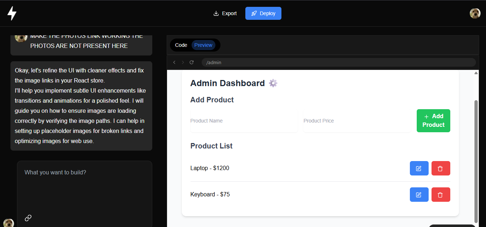
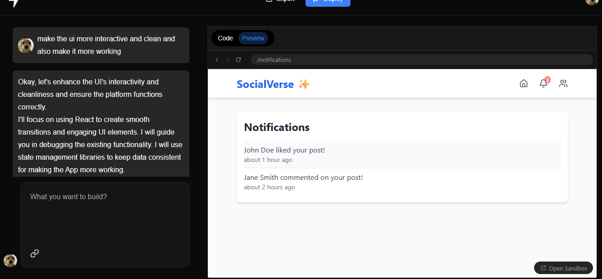
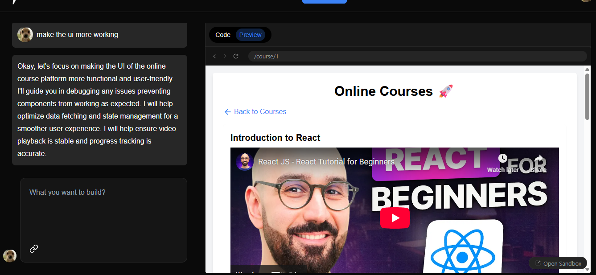
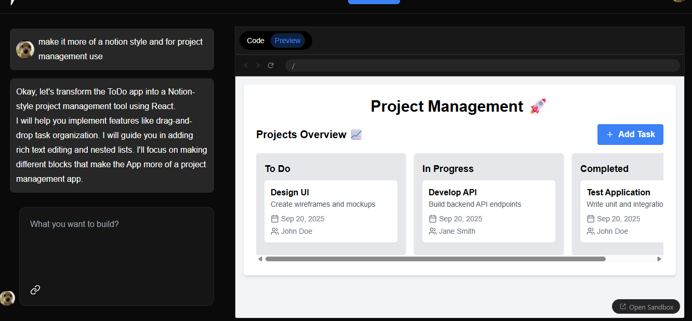

# Bolt2.0 - AI Website Maker

<div align="center">
  
  
  
  
</div>

<div align="center">
  <h3>Transform Simple Prompts into Complete Next.js Applications</h3>
  <p> <strong>No Templates • No Fluff • Just Clean, Scalable Code</strong></p>
</div>

---

##  What is Bolt2.0?

**Bolt2.0** is an AI-powered web development platform that transforms natural language prompts into production-ready, full-stack Next.js applications. Generate complete folder structures, typed components, API routes, and deployable code in minutes.

###  Key Features
- **Prompt-to-Production**: From idea to deployment in minutes
- **TypeScript-First**: Fully typed, enterprise-ready code
- **Zero Templates**: Custom-generated, unique solutions
- **Full-Stack**: Complete Next.js apps with API routes and database integration

---

## Technology Stack

| Frontend | Backend | AI & Tools |
|----------|---------|------------|
| Next.js 14+ | Next.js API Routes | Gemini API Integration |
| React 18+ | Convex DB | Custom AI Prompting |
| Javascript | NextAuth.js | Code Analysis |
| Tailwind CSS | Serverless Functions | Hot Reload |

---

## Quick Start

### Installation

```bash
# Clone and install
git clone https://github.com/Aryanwadhwa14/Bolt2.0.git
cd Bolt2.0
npm install
```

### Environment Setup

Create `.env.local`:

```env
OPENAI_API_KEY=your_openai_api_key_here
DATABASE_URL="your_database_connection_string"
NEXTAUTH_SECRET=your_nextauth_secret
NEXTAUTH_URL=http://localhost:3000
```

### Development

```bash
npm run dev
```

Open [http://localhost:3000](http://localhost:3000) to see the magic! 

---

## How to Use

### 1. **Describe Your Vision**
```
"Create a modern e-commerce store with product listings, shopping cart, and user authentication"
```

### 2. **Watch the Magic**
Bolt2.0 analyzes your prompt and generates:
- Complete file structure
- Typed React components
- API routes and database models
- Responsive design
- Proper error handling

### 3. **Customize & Deploy**
- Edit code in real-time
- Export complete project
- Deploy anywhere

---

## Example Prompts 



**Social Media App:**
```
"Create a social platform with user posts, comments, likes, and real-time notifications"
```


**Learning Platform:**
```
"Build an online course platform with video lessons, progress tracking, and certificates"
```


**Project Management:**
```
"Create a task management tool with team collaboration, time tracking, and reporting"
```


---

## Project Structure

```
Bolt2.0/
├── app/                    # Next.js App Router
│   ├── api/               # API endpoints
│   ├── components/        # React components
│   └── lib/               # Utilities
├── components/            # Shared components
├── lib/                   # Core utilities
│   ├── ai.ts             # AI integration
│   └── db.ts             # Database connection
├── types/                 # TypeScript definitions
└── public/               # Static assets
```

---

##  Generated Code Example

```typescript
// Generated React Component
interface ProductCardProps {
  id: string;
  name: string;
  price: number;
  image: string;
  onAddToCart: (id: string) => void;
}

export const ProductCard: React.FC<ProductCardProps> = ({
  id, name, price, image, onAddToCart
}) => {
  return (
    <div className="bg-white rounded-lg shadow-md hover:shadow-lg transition-shadow">
      
      <div className="p-4">
        <h3 className="text-lg font-semibold">{name}</h3>
        <p className="text-xl font-bold text-blue-600">${price}</p>
        <Button onClick={() => onAddToCart(id)} className="w-full mt-4">
          Add to Cart
        </Button>
      </div>
    </div>
  );
};
```

---

## API Reference

### Generate Project

```http
POST /api/generate
Content-Type: application/json

{
  "prompt": "Create a todo app with dark mode",
  "options": {
    "framework": "nextjs",
    "styling": "tailwind",
    "database": "prisma"
  }
}
```

**Response:**
```json
{
  "success": true,
  "projectId": "proj_1234567890",
  "files": [...],
  "preview": "https://preview-url.com"
}
```

---

## Deployment

### Vercel (Recommended)
```bash
npm i -g vercel
vercel --prod
```

### Netlify
```bash
npm run build
netlify deploy --prod --dir=out
```

### Docker
```dockerfile
FROM node:18-alpine
WORKDIR /app
COPY . .
RUN npm ci && npm run build
EXPOSE 3000
CMD ["npm", "start"]
```

---

##  Contributing

1. Fork the repository
2. Create feature branch: `git checkout -b feature/amazing-feature`
3. Commit changes: `git commit -m 'feat: add amazing feature'`
4. Push to branch: `git push origin feature/amazing-feature`
5. Open a Pull Request

### Areas for Contribution
-  UI/UX improvements
-  AI model enhancements
-  Framework support (Vue, Angular)
-  Database integrations
-  Documentation

---

##  Performance

| Metric | Score |
|--------|-------|
| Simple Apps | < 30 seconds |
| Medium Complexity | 1-2 minutes |
| Complex Apps | 3-5 minutes |
| TypeScript Coverage | 100% |
| Performance Score | 90+ |

---

##  FAQ

**Q: How is this different from other AI generators?**
A: Bolt2.0 creates production-ready, full-stack Next.js apps with complete TypeScript support, not templates.

**Q: Can I customize the generated code?**
A: Yes! All code is fully editable and exportable. You own it completely.

**Q: What databases are supported?**
A: PostgreSQL, MySQL, SQLite, and ConvexDB through Prisma ORM.

**Q: Is it production-ready?**
A: Yes! Code follows best practices with proper error handling and security.

---

<div align="center">
  <h3> Ready to Build Something Amazing?</h3>
  <p>
    <a href="https://github.com/Aryanwadhwa14/Bolt2.0/fork">
      
    </a>
    <a href="https://github.com/Aryanwadhwa14/Bolt2.0">
      
    </a>
  </p>
  
  <p><strong>Transform your ideas into reality with the power of AI</strong></p>
  
  <a href="#-quick-start">Get Started</a> •
  <a href="#-how-to-use">Documentation</a> •
  <a href="#-contributing">Contribute</a>
</div>

---

<div align="center">
  <sub>Built with ❤️ by <a href="https://github.com/Aryanwadhwa14">Aryan Wadhwa</a></sub>
</div>
